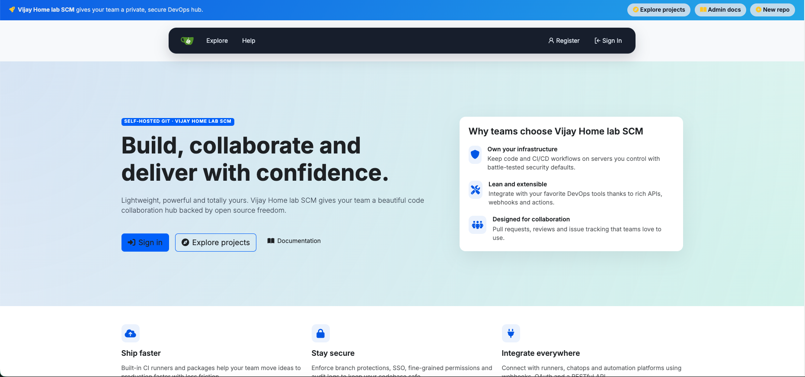

# Gitea Bootstrap 5 Landing Page Theme

A drop-in theme that replaces the public front page of a Gitea instance with a modern Bootstrap 5 + Font Awesome experience. Signed-in users see a refreshed quick-action dashboard row, while guests get a marketing-style hero layout with prominent calls to action.



## What's Included

- `custom/templates/home.tmpl` – overrides the default landing page with a Bootstrap 5 design
- `custom/templates/custom/header.tmpl` – injects Bootstrap, Font Awesome, typography, and inlined theme styles
- `custom/templates/custom/body_inner_pre.tmpl` – adds a compact promotional banner above the navigation bar
- `custom/templates/custom/footer.tmpl` – delivers a multi-column footer with curated resource links

## Prerequisites

- Gitea 1.18+ (tested against the current `main` template structure)
- Access to the `custom/` directory on your Alpine Linux host (default `/var/lib/gitea/custom` when using the official packages)

## Installation

1. **Stop Gitea (optional but safest):**
   ```sh
   sudo rc-service gitea stop
   ```
2. **Copy the theme files:**
   ```sh
   sudo rsync -av custom/ /var/lib/gitea/custom/
   ```
   Adjust the destination path if your `APP_DATA_PATH` differs.
3. **Fix permissions:**
   ```sh
   sudo chown -R git:git /var/lib/gitea/custom
   ```
   Replace `git:git` with the user/group running your Gitea service.
4. **Start or restart Gitea:**
   ```sh
   sudo rc-service gitea start
   ```
5. **Bust caches (optional but recommended):** add or increment `ui.asset_version` in `app.ini`, or clear `$GITEA_CUSTOM/public` cache if you use a CDN.

## Configuration Tips

- No configuration changes are required, but you can force the refreshed styles to load by setting `ui.use_service_worker = false` if you rely on aggressive caching.
- To adjust colors or typography, edit the `<style>` block in `custom/templates/custom/header.tmpl`; Bootstrap utility classes let you rapidly tweak the layout.
- The template references Bootstrap and Font Awesome via CDNs. If your installation is air-gapped, replace the CDN URLs with self-hosted copies and drop them in `custom/public`.

## Verification Checklist

After copying the files, visit your instance root URL:

- Logged-out visitors should see the hero landing page with CTA buttons, feature highlights and the install checklist.
- Logged-in users should see the "Welcome back" dashboard card with quick action buttons.
- The top navigation bar should render with the glassmorphism background and rounded menu pills, with the announcement banner above it.
- The footer should show the new three-column resource section followed by the standard Gitea footer.

## Troubleshooting

- **Styles didn't update** – Make sure `custom/templates/custom/header.tmpl` copied correctly and bump `ui.asset_version` in `app.ini` to invalidate the service worker cache.
- **CDN blocked or SRI mismatch** – If the environment strips query params or modifies assets, host Bootstrap and Font Awesome locally inside `custom/public/vendor/` and update the links in `custom/templates/custom/header.tmpl` (remove the `integrity` attribute when serving self-hosted copies).
- **Navbar dropdown hidden behind content** – Ensure you're using the latest `custom/templates/custom/header.tmpl`; it sets a higher `z-index` for Gitea's dropdown menus so they stack above repository cards.

## Updating

To revert to the stock appearance, delete the overrides:
```sh
sudo rm -rf /var/lib/gitea/custom/templates/home.tmpl \
            /var/lib/gitea/custom/templates/custom/header.tmpl \
            /var/lib/gitea/custom/templates/custom/body_inner_pre.tmpl \
            /var/lib/gitea/custom/templates/custom/footer.tmpl
```
Then restart Gitea.

Happy theming! 🎨
